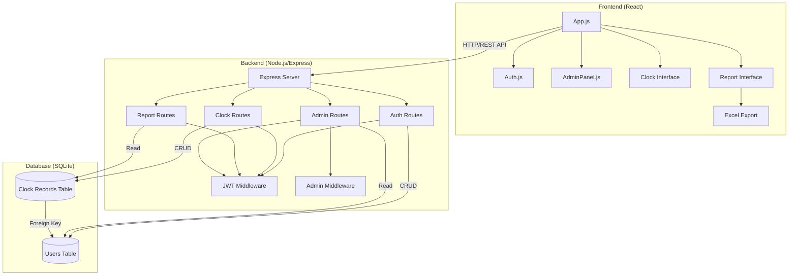
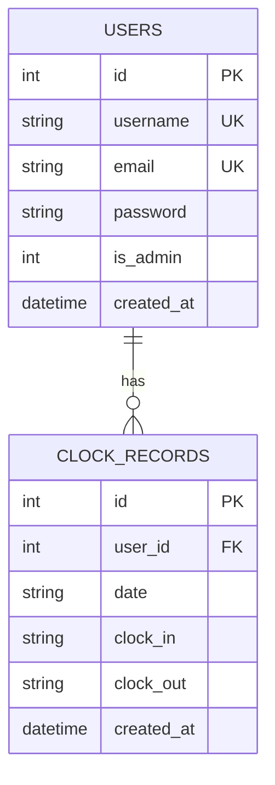
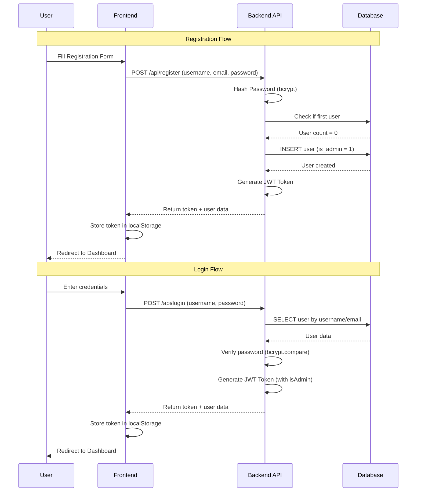
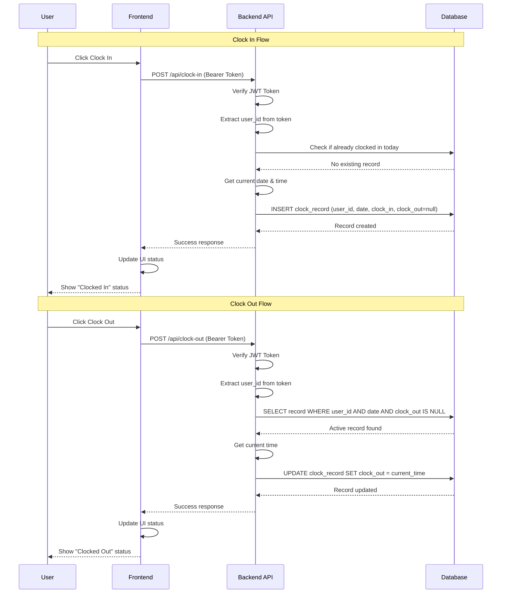
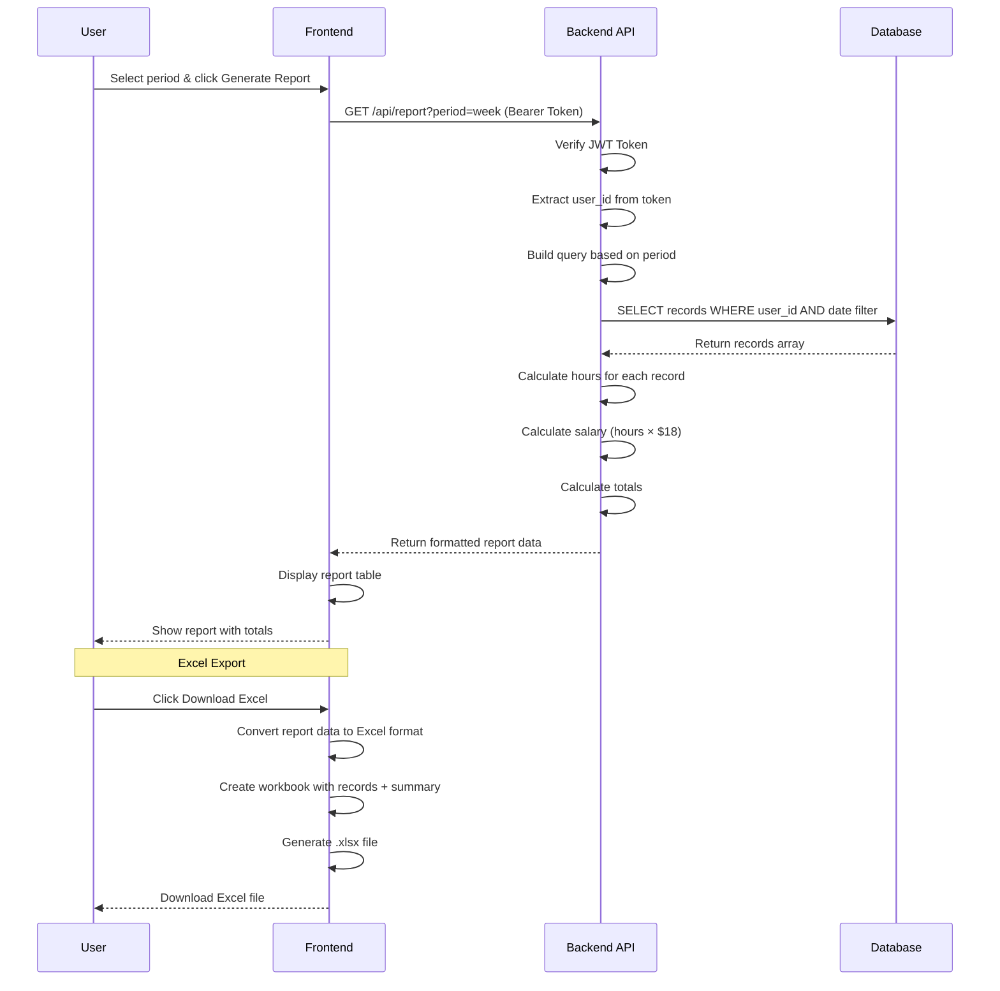
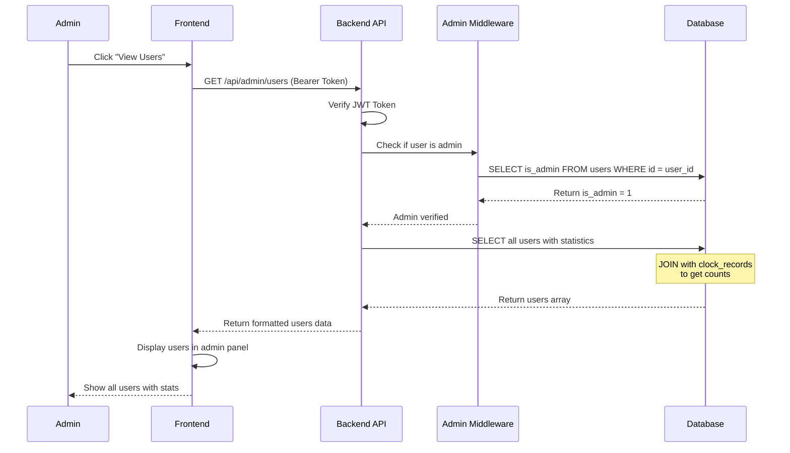
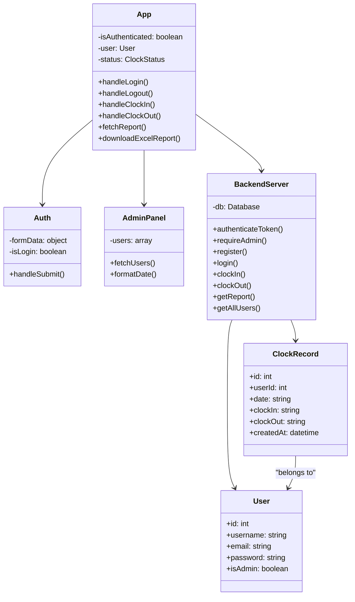
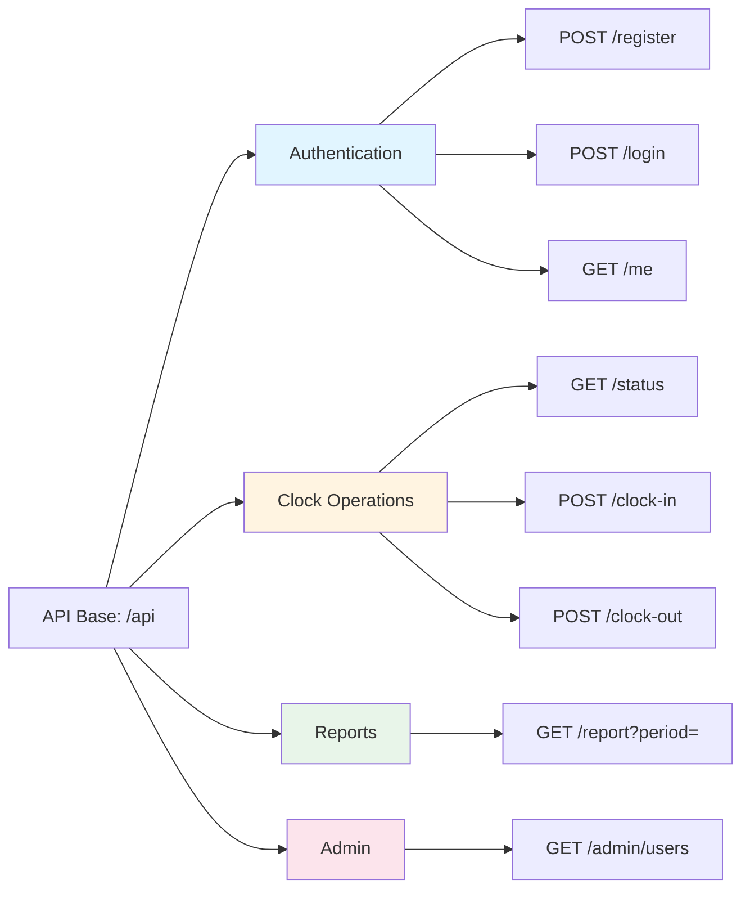

# UML Diagrams - Clock In/Out System

This document contains UML diagrams for the Clock In/Out System architecture, database schema, and key workflows.

## 1. System Architecture Diagram

## 2. Database Schema (ER Diagram)

## 3. Authentication Flow Sequence Diagram

## 4. Clock In/Out Flow Sequence Diagram

## 5. Report Generation Flow Sequence Diagram

## 6. Admin User Management Flow

## 7. Component Class Diagram

## 8. API Endpoints Structure

## Notes

- **Mermaid diagrams** are rendered automatically on GitHub
- All API endpoints require JWT authentication (except register/login)
- Admin endpoints require additional admin role verification
- Database uses SQLite with foreign key relationships
- Frontend uses React with Axios for API calls
- Excel export is handled client-side using XLSX library

